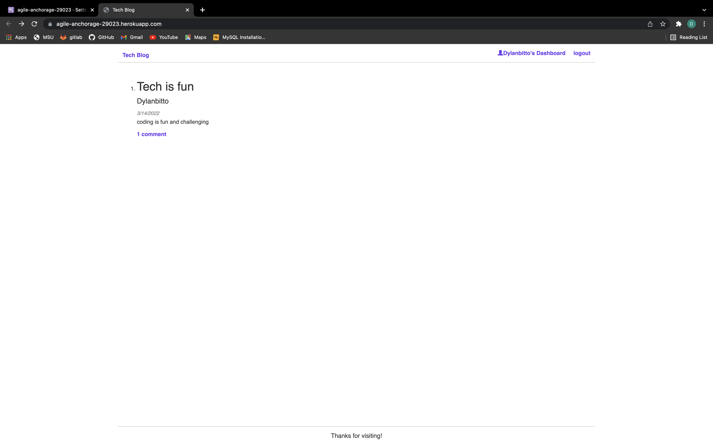

# Tech Blog
  ## Table of Contents
  * [Project Description](#project-description)
  * [Installation](#installation)
  * [Usage](#usage)
  * [License](#license)
  * [Contributing](#contributing)
  * [Questions?](#questions)
  ## Project Description
  A tech blog that allows a user to post about whatever they wish. It supports account creation with secure password hashing and storage as well as the ability to login. Users can view all posts, or go to their dashboards to see the posts they have made. They can also comment on posts if they are logged in.
  ## Installation
  npm install
  ## Usage
  npm start
  ## License
  This project is under MIT for licensing.
  
  ## Contributing
  Feel free to submit code.
  ## Website
  https://agile-anchorage-29023.herokuapp.com/
  
  
  ## Questions
  please feel free to ask me any questions.
  Github username: Dylanbitto
  Github Email: <Dylanbitto5425@gmail.com>
  